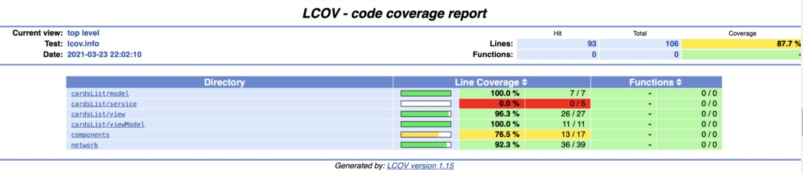
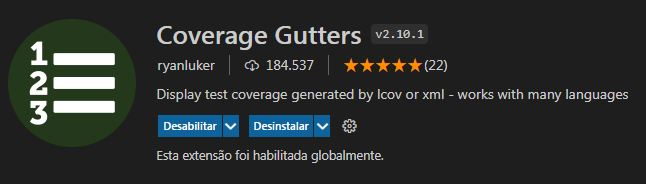
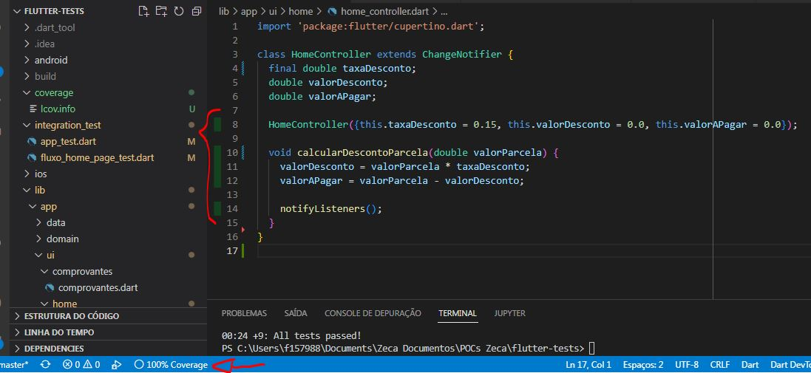
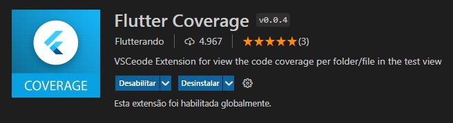
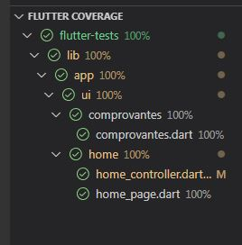

# Flutter Tests

Exemplo de aplicação Flutter usando Tests (unidade, widget e integração)

Documentação: https://docs.flutter.dev/testing

Para testar podemos utilizar o botão "run" ou "debug" direto do código do teste

ou rodar os seguintes comandos, dentro do diretório da aplicação, via terminal:

**flutter test** -> irá executar todos os testes, com exeção dos testes de integração

**flutter test integration_test** -> irá executar todos os testes, incluindo os testes

de integração. É necessário ter um emulador ou dispositivo conectado, pois os

testes de integração abrem e executam no dispositivo, igual um usuário faria.

Para gerar métricas utilize e flag **--coverage** após o comando de test:

**flutter test --coverage**

Este comando irá gerar o diretório coverage\ no seu projeto contendo um arquivo lcov.info.

Esse arquivo pode ser lido pela aplicação lcov (necessário instalar), que irá gerar em formato html as métricas

de cobertura de testes.

Para gerar em html rodar os comandos:

**flutter test --coverage** -> roda os testes e gera o locv.info

**genhtml coverage/lcov.info -o coverage/html** -> gera html com métricas

**open coverage/html/index.html** -> abre o arquivo de métricas gerado

Exemplo Relatório Coverage :

Também é possível visulizar as métricas geradas pelo coverage instalando extensões 

no vscode. Temos duas extensões que podem ser usadas isoladas ou em conjunto:

**https://marketplace.visualstudio.com/items?itemName=ryanluker.vscode-coverage-gutters**

Exibe em cada arquivo as linhas cobertas por teste na cor verde e as não cobertas em vermelho

Extensão VSCode:

Exemplo métricas:

**https://marketplace.visualstudio.com/items?itemName=Flutterando.flutter-coverage**

Exibe na aba de testes do vscode o percentual de cobertura de testes do projeto todo,

mostrando quais arquivos estão com cobertura pendente. Também é possível definir uma meta 

qualidade (em percentual), para que dê ênfase nos arquivos que não atingirem essa meta

Extensão VSCode:

Exemplo métricas:

